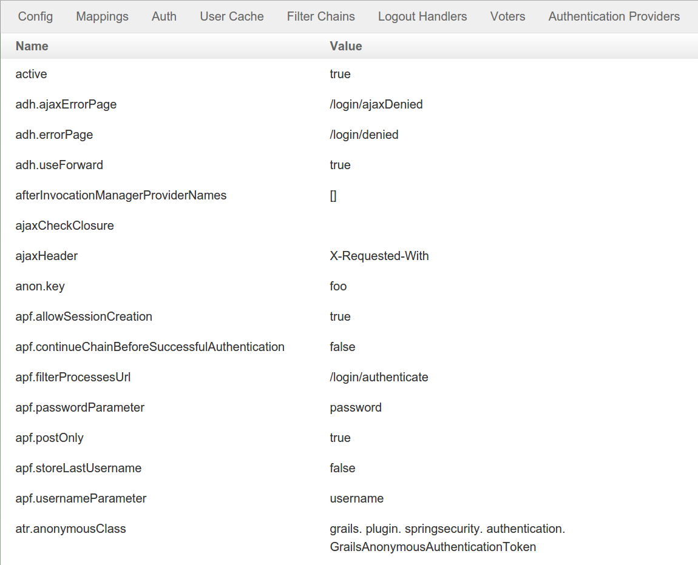
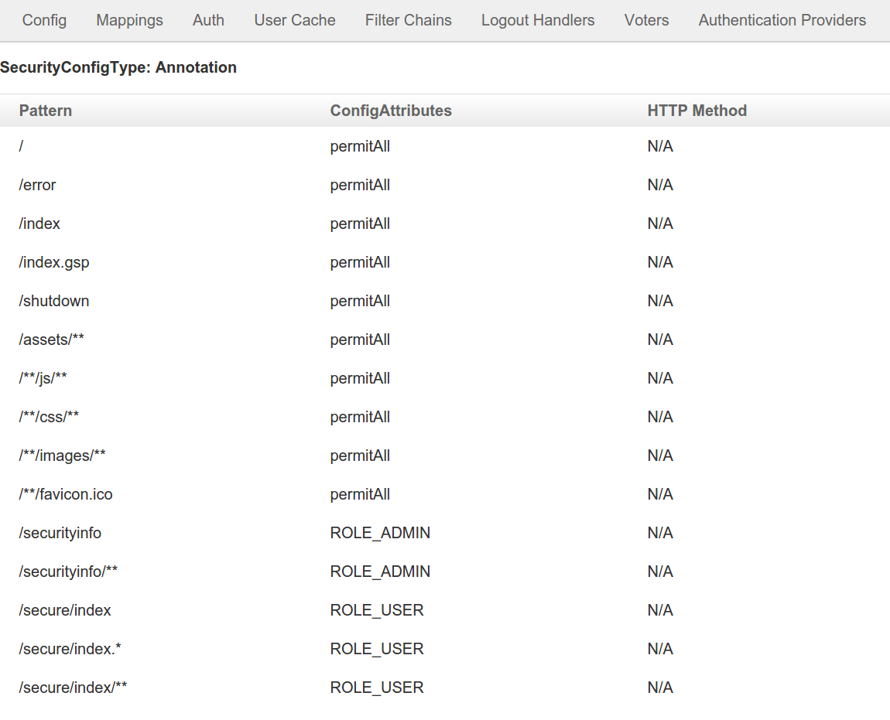
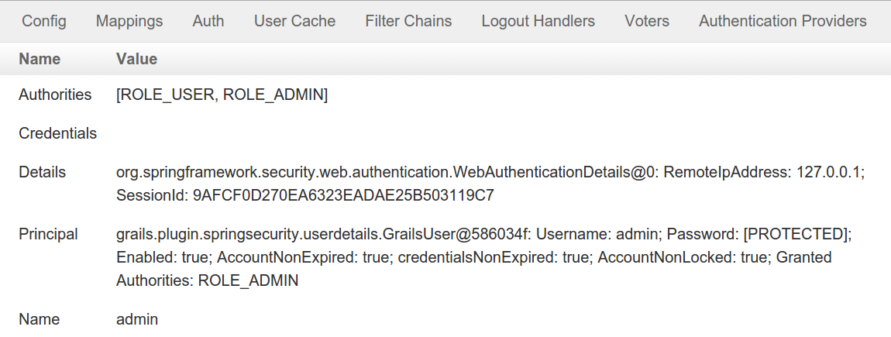
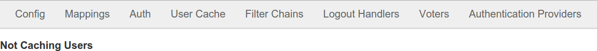
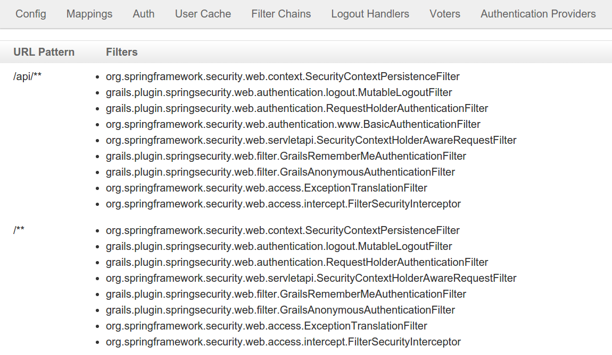
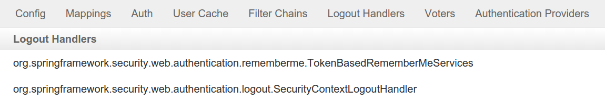
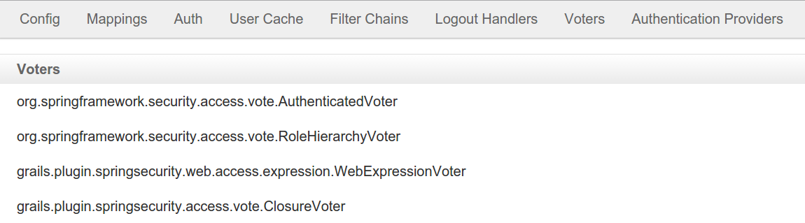
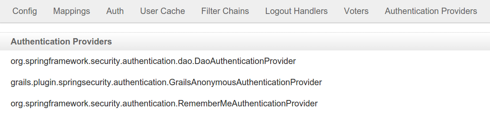

[[ui]]
== Security Configuration UI

The plugin has one controller (`SecurityInfoController.groovy`) and is available by navigating to `/securityInfo`. There are eight menus:

=== Configuration

The Configuration menu item displays all security-related attributes in `grails-app/conf/application.groovy`. The names omit the `grails.plugin.springsecurity` prefix:

=== Mappings

The Mappings menu item displays the current request mapping mode (Annotation, Requestmap, or Static) and all current mappings:

=== Current Authentication

The Current Authentication menu item displays your `Authentication` information, mostly for reference to see what a typical one contains:

=== User Cache

The User Cache menu item displays information about cached users (this feature is disabled by default):

=== Filter Chains

The Filter Chains menu item displays your configured Filter chains. Typically there is just one chain, applied to all URLs

It is possible to have multiple URL patterns each with its own filter chain, for example when using HTTP Basic Auth for a web service.

=== Logout Handlers

The Logout Handlers menu item displays your registered ``LogoutHandler``s. Typically there will be just the two shown here, but you can register your own custom implementations, or a plugin might contribute one or more:

=== Voters

The Voters menu item displays your registered ``AccessDecisionVoter``s. Typically there will be just the three shown here, but you can register your own custom implementations, or a plugin might contribute one or more:

=== Authentication Providers

The Authentication Providers menu item displays your registered ``AuthenticationProvider``s. Typically there will be just the three shown here, but you can register your own custom implementations, or a plugin (e.g. LDAP) might contribute one or more:

